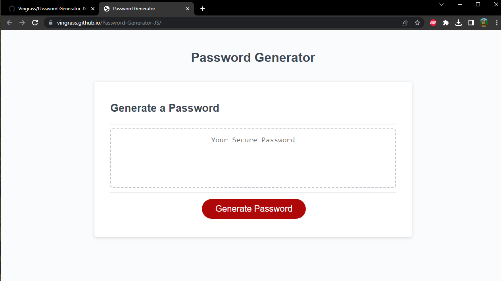

# Password Generator
### Made by Vincent Ingrassia

This application generates a random phrase to be used as a password. The critrea for the password is set by the user. When they generate a new phrase, the user is asked a series of questions setting the parameters for the password.

This is done by an intial prompt to get the length of the password. If the user enters an invalid response (Min 8, max 128) they will be re-asked until they enter a valid length. Then the user is asked what character types they want used in the password generation, upper case, lower case, numbers, or special characters. If the user says no all of these, they are given a message that the password needs critrea, then the process ends.

Link to application:
https://vingrass.github.io/Password-Generator-JS/

